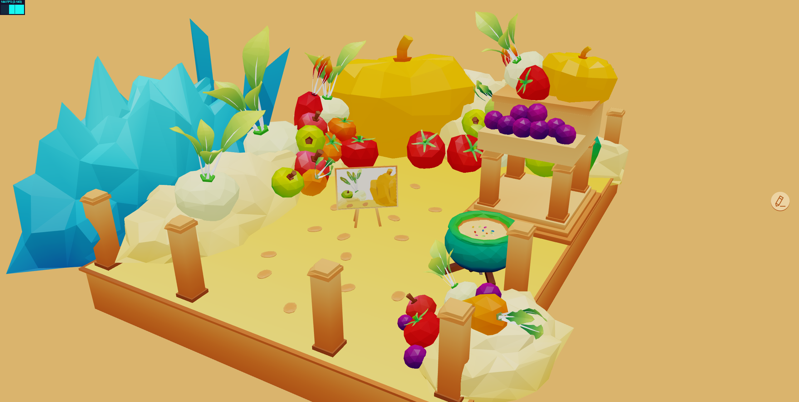
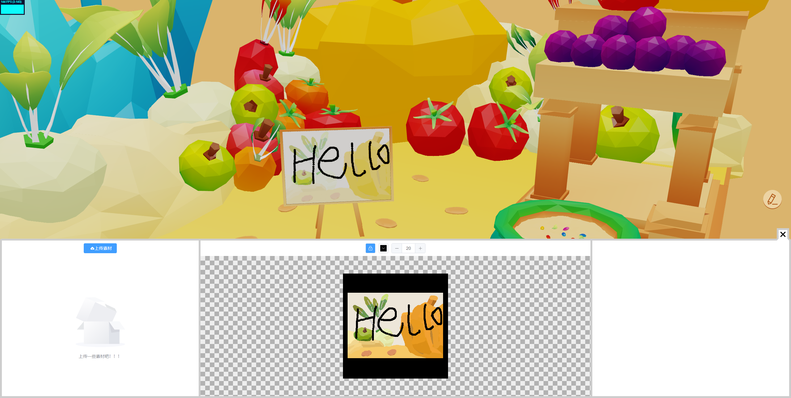

# Tauri + Vue 3

This template should help get you started developing with Tauri + Vue 3 in Vite. The template uses Vue 3 `<script setup>` SFCs, check out the [script setup docs](https://v3.vuejs.org/api/sfc-script-setup.html#sfc-script-setup) to learn more.
[Tauri docs](https://tauri.app/zh-cn/v1/guides/getting-started/setup/vite) to learn more.

# Recommended IDE Setup

- [VS Code](https://code.visualstudio.com/) + [Volar](https://marketplace.visualstudio.com/items?itemName=Vue.volar) + [Tauri](https://marketplace.visualstudio.com/items?itemName=tauri-apps.tauri-vscode) + [rust-analyzer](https://marketplace.visualstudio.com/items?itemName=rust-lang.rust-analyzer)

#install

```
npm install
```

#run

```
npm run dev / npm run tauri dev
```

#build

```
npm run build / npm run tauri build
```



